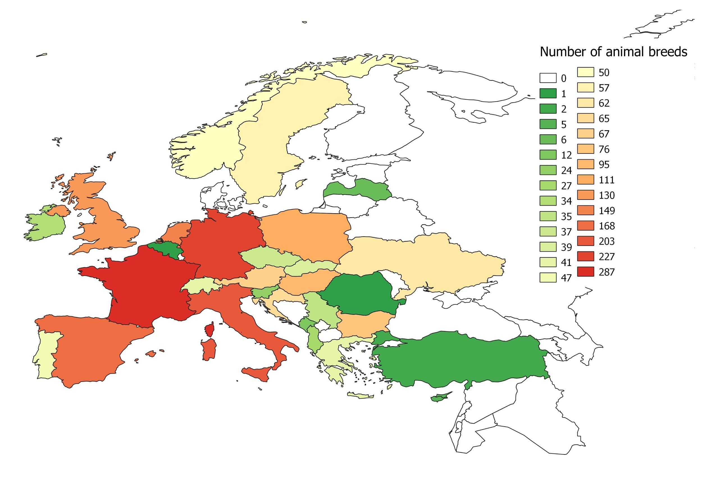
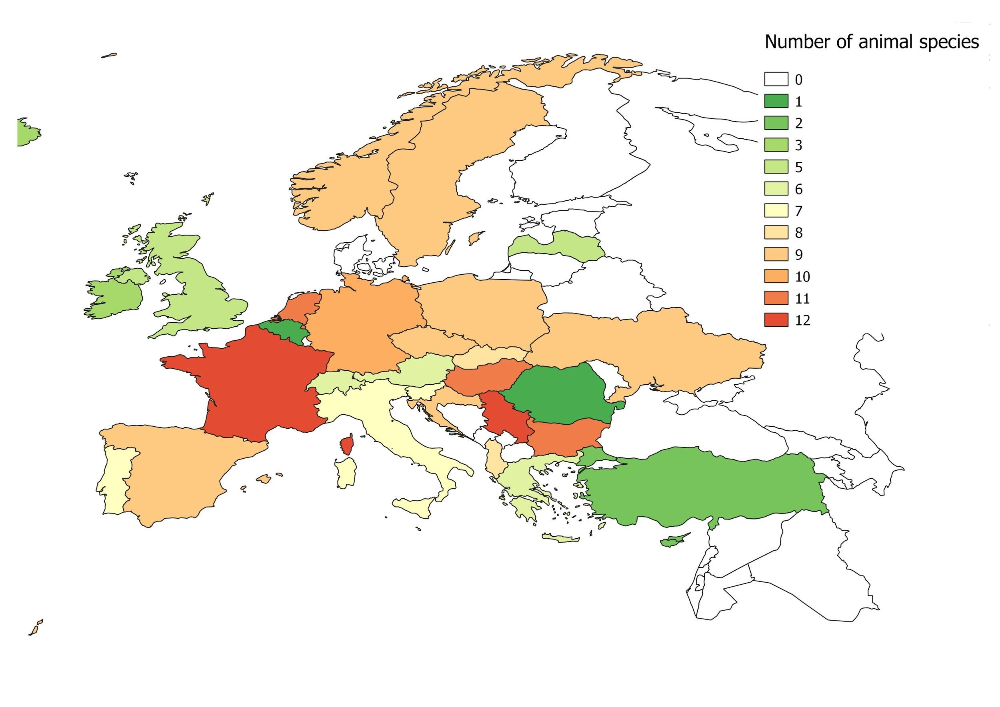
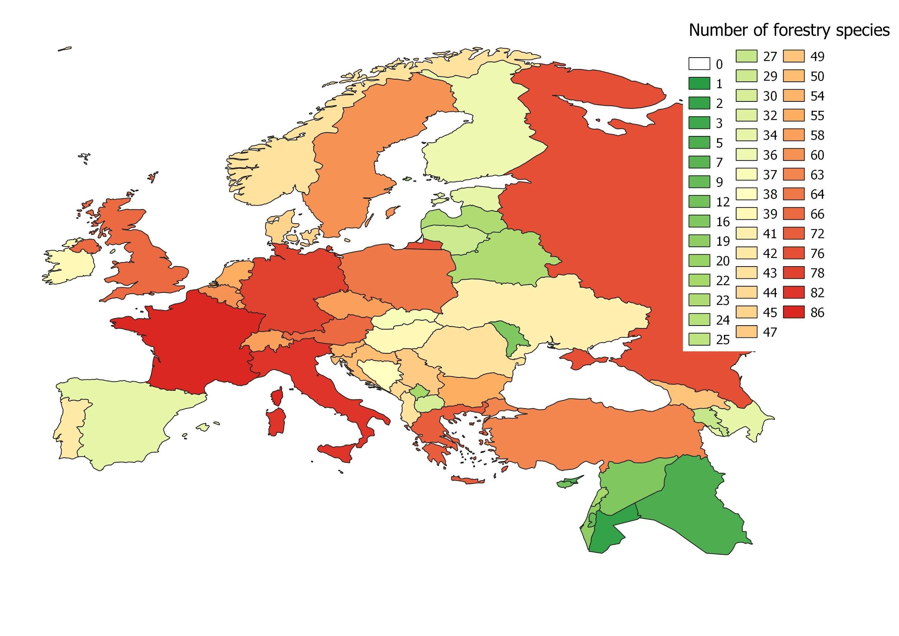
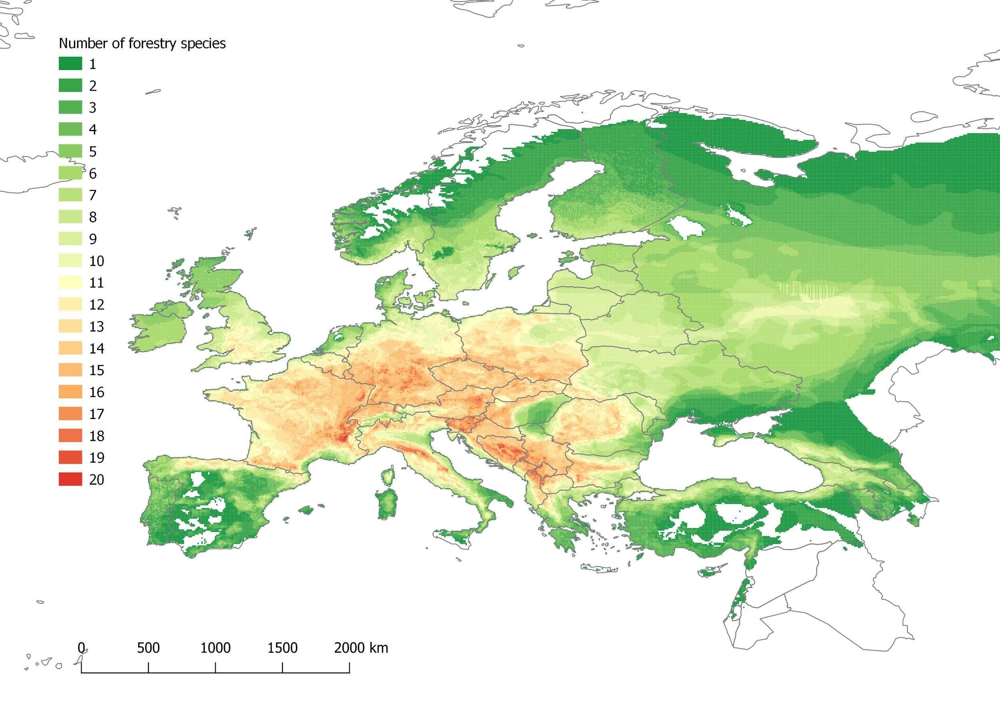

```{r}
source("./src/plot_animals.R")
```

## Animal breeds on country level


```{r}
plot_animal(sf_europe, animal_data, number_breeds)
plot_animal(sf_europe, animal_data, number_breeds, interactive = TRUE)
```

## Animal species on country level



```{r}
plot_animal(sf_europe, animal_data, number_species)
plot_animal(sf_europe, animal_data, number_species, interactive = TRUE)
```

## Forestry species on country level



## Forestry species in Europe



## Landrace richness


